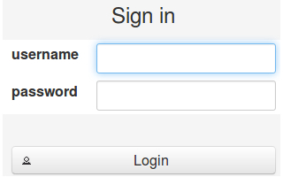
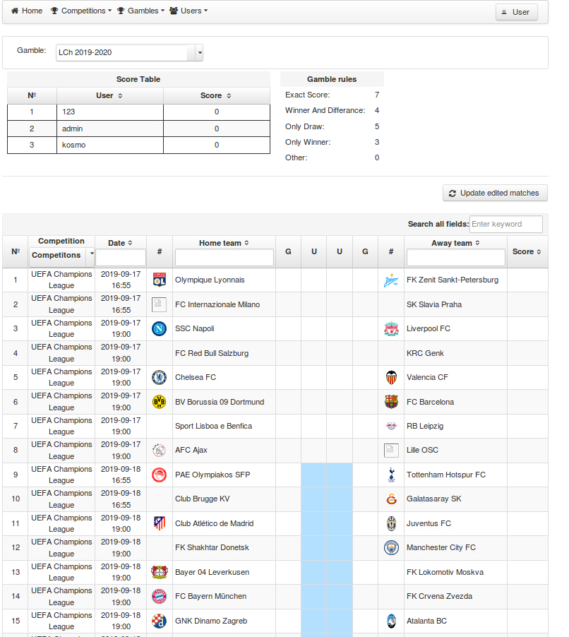

# FootballGamble
Build status: [](https://travis-ci.com/AnGo84/FootballGamble.svg)
- - -
The Project is View for [FootballDataRestAPI]. 
For simplifies construction of user interfaces for server-based application used [JFS] and it's framework [PrimeFaces].  
For enables [JSF] usage inside [Spring Boot Application] using [JoinFaces]. 
JoinFaces Example: https://github.com/joinfaces/joinfaces-maven-war-example

### Requirements:

- IDE
- JDK 1.8 or later
- Maven
- JoinFaces

The app will start running at:
```sh
localhost:8085
```
First of all, you need to add Users to the database.

### Screenshot of working program:




License
----
MIT
**Free Software, Hell Yeah!**

[FootballDataRestAPI]: <https://github.com/AnGo84/FootballDataRestAPI>
[JSF]: <https://www.oracle.com/technetwork/java/javaee/javaserverfaces-139869.html>
[PrimeFaces]: <https://www.primefaces.org/>
[Spring Boot Application]: <https://spring.io/projects/spring-boot>
[JoinFaces]: <http://joinfaces.org/>


